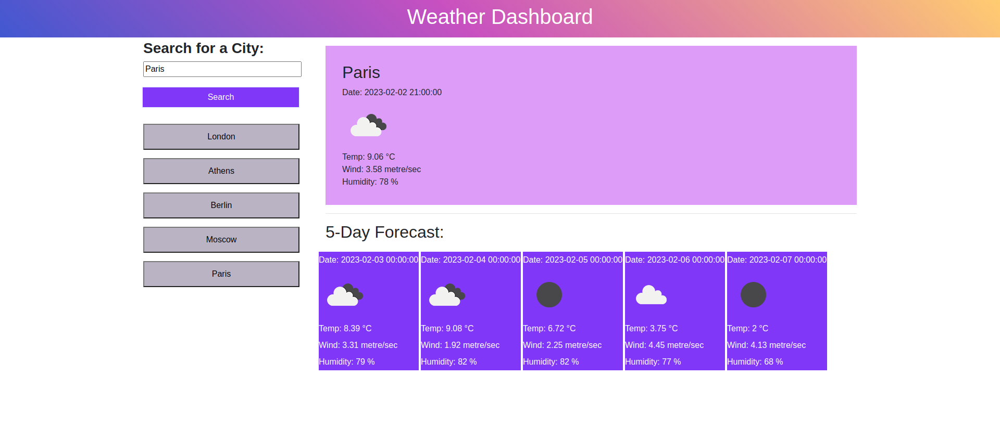

# Weather Dashboard_EDementieva

## Description

The task in this Challenge is to create an app that allows users to see the weather forecast for cities of their choosing.

In this Challenge I used the 5 day weather forecast from https://openweathermap.org/ to retrieve weather data for cities.

The app runs in the browser and features dynamically updated HTML and CSS.

## Installation

N/A

## Usage of the application:

When a user searches for a city they are presented with current and future conditions for that city and that city is added to the search history.

When a user views the current weather conditions for that city they are presented with:

    The city name

    The date

    An icon representation of weather conditions

    The temperature

    The humidity

    The wind speed

When a user views future weather conditions for that city they are presented with a 5-day forecast that displays:

    The date

    An icon representation of weather conditions

    The temperature

    The humidity

When a user clicks on a city in the search history they are again presented with current and future conditions for that city.

https://coralpeony.github.io/Daily_Planner_App_EDementieva/

## Credits

N/A

## License

MIT License